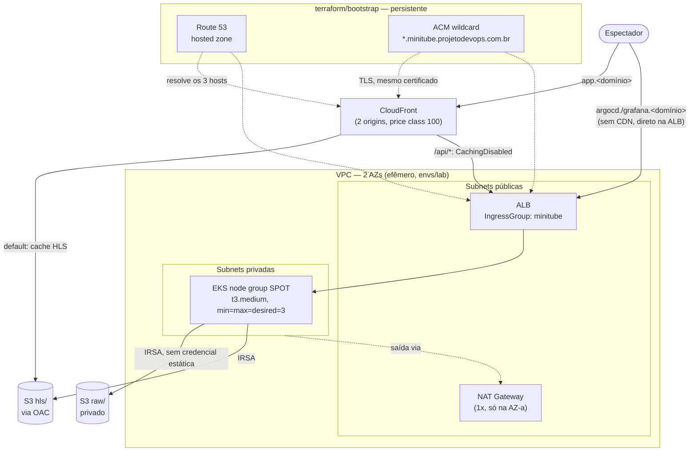
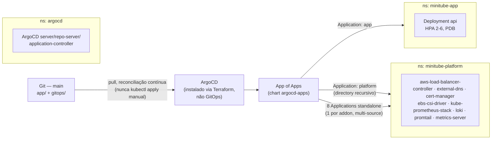
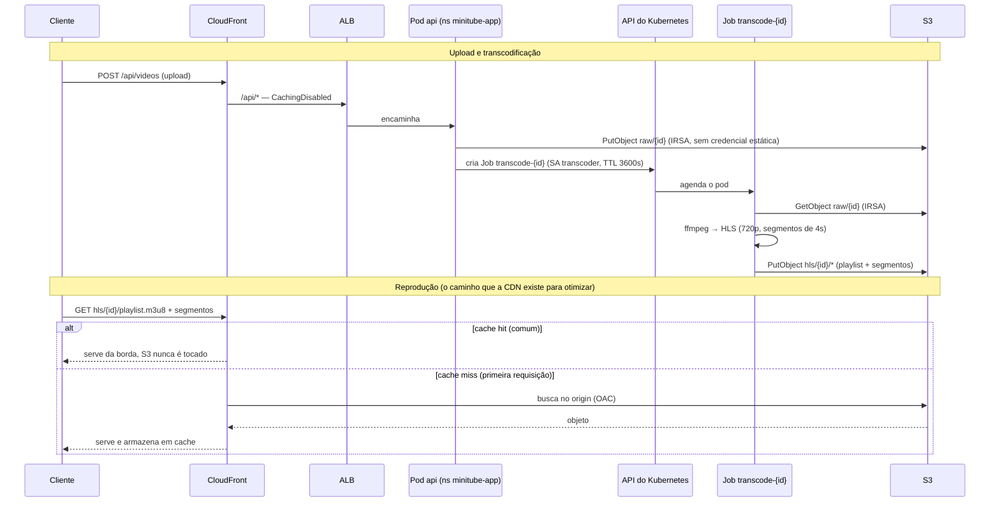
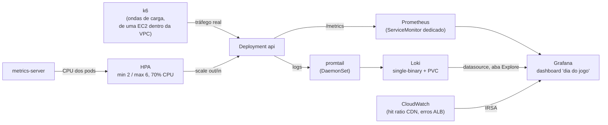

# Arquitetura

> Detalha, com diagramas, a arquitetura descrita em resumo no [`CLAUDE.md`](../CLAUDE.md#arquitetura-alvo). Cada decisão aqui já foi documentada em algum ADR — este documento **não repete o raciocínio completo**, só amarra o desenho geral e linka para onde aprofundar. Serve de referência técnica e de material-base para a divulgação do projeto (ver [`docs/showcase-urls.md`](showcase-urls.md)).

## Por que essa arquitetura

A pergunta que motiva o projeto inteiro ([`000-motivation.md`](000-motivation.md)): como o YouTube aguenta um pico de audiência do tamanho de uma final de Copa do Mundo? A resposta curta orienta as quatro decisões centrais abaixo — o resto da arquitetura existe para sustentar essas quatro:

1. **Cache na borda absorve a imensa maioria do tráfego.** Vídeo é conteúdo estático depois de gerado — servir os segmentos HLS via CloudFront, direto do S3, significa que a origem nunca vê a maior parte das requisições. Rotas dinâmicas (`/api/*`) são a exceção deliberada, roteadas sem cache.
2. **A origem escala horizontalmente, não verticalmente.** A API roda em EKS com HPA (CPU), não numa instância única maior — o teto de capacidade é uma configuração (`maxReplicas`), não um limite físico de hardware.
3. **Tudo reconciliado a partir do Git, nada aplicado à mão.** GitOps via ArgoCD elimina uma classe inteira de incidente (drift entre o que foi de fato configurado e o que está documentado) — decisão central do projeto, não um detalhe de implementação.
4. **Infraestrutura efêmera por padrão.** `envs/lab` inteiro (VPC, EKS, CloudFront) sobe e desce a cada sessão; só o que tem custo baixo e fixo persiste (state, DNS, ECR, IAM).

## 1 — Infraestrutura e rede

**Por quê:**
- **1 NAT Gateway só**, não um por AZ — custo controlado, é o "single point of egress" documentado no `terraform/modules/vpc`. Trade-off consciente (resiliência cross-AZ por custo), coerente com o princípio de custo do `CLAUDE.md`.
- **Node group SPOT** — instâncias mais baratas para uma carga que tolera interrupção (a API tem PDB e réplicas ≥2; o transcoder é um Job, não um serviço contínuo). `min=max=desired=3` porque o limite real hoje é o teto de ENI/IP por nó (`t3.medium`), não CPU — ver [ADR 013](adr/013-terraform-vpc-eks-modules.md).
- **`app.<domínio>` não passa pela ALB para servir vídeo** — CloudFront lê o S3 direto (origin `s3-video`, OAC). Só `/api/*` (upload, status) atravessa a ALB, sem cache.
- **`argocd.<domínio>` e `grafana.<domínio>` não passam pelo CloudFront** — vão direto na ALB. Decisão registrada no [ADR 008](adr/008-cloudfront-dns-tls.md): são interfaces operacionais, não conteúdo de audiência, cachear ou passar pela CDN não traria benefício.
- **Um único certificado ACM wildcard, gerado uma vez em `terraform/bootstrap/`** ([ADR 001](adr/001-terraform-state-backend.md)/[ADR 008](adr/008-cloudfront-dns-tls.md)) — reaplicações de `envs/lab` só leem esse certificado via `data source`, nunca reemitem.

## 2 — GitOps e plataforma

**Por quê:**
- **App of Apps** ([ADR 007](adr/007-argocd-gitops-bootstrap.md)) — o bootstrap do ArgoCD fica declarativo: um único `helm_release` no Terraform declara as 10 `Application`s, sem precisar de nenhum `kubectl apply` inicial fora do Terraform.
- **Padrão multi-source em cada addon de plataforma** (`source[0]` = `values.yaml` versionado neste repo, `source[1]` = chart Helm oficial) — permite usar o chart oficial upstream sem fazer fork, mantendo a configuração específica do projeto (ARNs de IRSA, hosts) versionada e revisável.
- **`kube-prometheus-stack` exige `ServerSideApply=true`** — os CRDs do Prometheus Operator excedem o limite de tamanho do client-side apply padrão do Kubernetes.
- **ArgoCD em si nasce do Terraform, não do Git** — dependência circular óbvia (não dá para o ArgoCD reconciliar a própria instalação antes de existir); é a única exceção documentada ao princípio "tudo é GitOps".

## 3 — Fluxo de vídeo: upload, transcodificação e reprodução

**Por quê:**
- **Transcoder como Job Kubernetes, não um Deployment de longa duração** ([ADR 006](adr/006-app-irsa-and-job-orchestration.md)) — transcodificação é um trabalho de execução única; um Job com `ttl_seconds_after_finished` se autolimpa, sem precisar de scheduler externo.
- **Uma única IAM role IRSA compartilhada** entre os ServiceAccounts `api` e `transcoder` — ambos só precisam de `s3:GetObject`/`PutObject`/`ListBucket` no mesmo bucket; nenhum dos dois usa uma credencial estática AWS.
- **`raw/` nunca é servido publicamente** — a bucket policy do S3 restringe a leitura via CloudFront a `hls/*`; o vídeo bruto do upload não é acessível fora do fluxo de transcodificação.
- **O header `X-Cache` da resposta é a evidência funcional real** de que a CDN está absorvendo tráfego — validado em `scripts/validate-cloudfront-dns-tls.sh`, é o mesmo dado que compõe o checklist de prints em [`showcase-urls.md`](showcase-urls.md).

## 4 — Autoscaling e observabilidade sob carga

**Por quê:**
- **HPA por CPU, não Cluster Autoscaler/Karpenter** ([ADR 012](adr/012-hpa-cpu-autoscaling.md)) — o gargalo real medido em carga (k6 breakpoint) era CPU de réplica única da API, não capacidade de nó; escalar pods resolve o problema medido, sem a complexidade adicional de escalar nós dinamicamente.
- **k6 rodando de uma EC2 dentro da própria VPC**, não do laptop do operador — ruído de rede do caminho cliente→AWS mascarava o teto de capacidade real (achado documentado em [`load/README.md`](../load/README.md)).
- **Loki em modo single-binary + filesystem**, não distributed + S3 ([ADR 011](adr/011-observability-stack.md)) — sem ganho num ambiente que é destruído a cada sessão; a complexidade operacional extra não se paga.
- **Grafana lê CloudWatch via IRSA própria** — hit ratio do CDN e erros 5xx da ALB só existem no CloudWatch, não no Prometheus (métricas de infraestrutura AWS gerenciada, não da aplicação).

## Onde cada coisa vive no repositório

| Diagrama | Terraform | GitOps |
| --- | --- | --- |
| 1 — Infra/rede | `terraform/modules/{vpc,eks}/`, `terraform/envs/lab/{cloudfront,dns-data,s3}.tf` | `gitops/*/ingress.yaml` |
| 2 — GitOps/plataforma | `terraform/envs/lab/argocd.tf` | `gitops/platform/*/values.yaml` |
| 3 — Fluxo de vídeo | `terraform/envs/lab/iam-app.tf` | `app/api/`, `app/transcoder/`, `gitops/app/` |
| 4 — Autoscaling/observabilidade | `terraform/envs/lab/iam-platform.tf` | `gitops/platform/{kube-prometheus-stack,loki,promtail,metrics-server}/`, `gitops/app/hpa.yaml` |

## Divergências conhecidas do texto vs. o desenho

- `cert-manager` está instalado (com `ClusterIssuer` via DNS-01/Route53) mas **não emite nenhum certificado real hoje** — TLS em produção usa o ACM wildcard do bootstrap. O `ClusterIssuer` existe como capacidade já pronta, não como caminho ativo (nota em `terraform/envs/lab/iam-platform.tf`).
