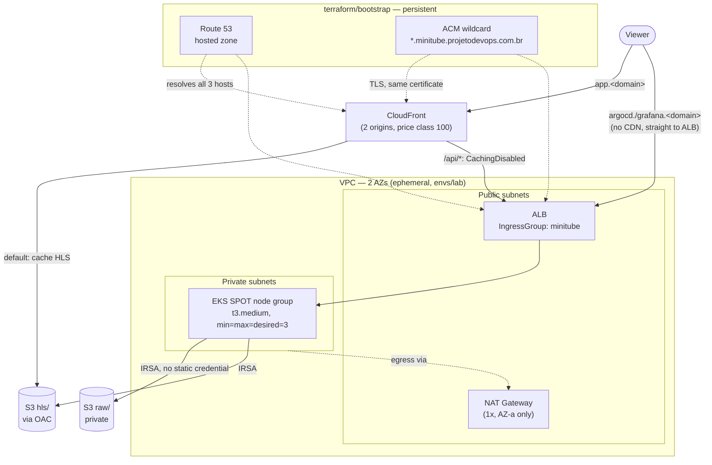
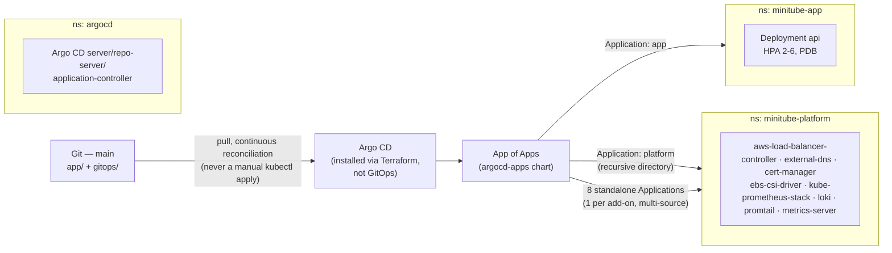
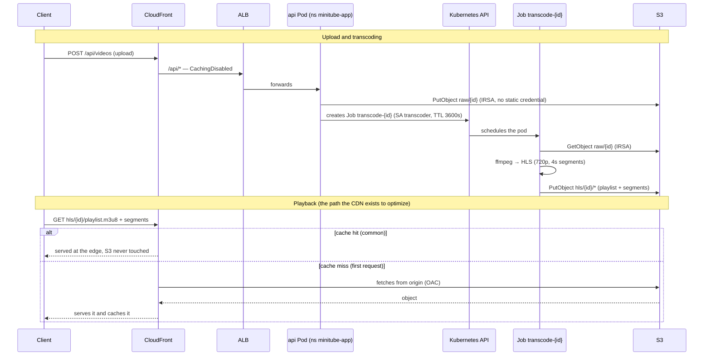
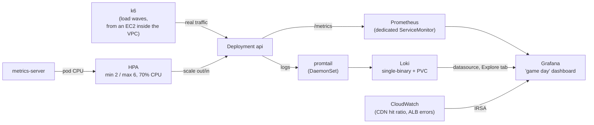

# Architecture

> Details, with diagrams, the architecture summarized in [`CLAUDE.md`](../CLAUDE.md#target-architecture). Every decision here is already documented in some ADR — this document **doesn't repeat the full reasoning**, it just ties the overall design together and links to where to go deeper. Serves as technical reference and base material for promoting the project (see [`docs/showcase-urls.md`](showcase-urls.md)).

## Why this architecture

The question that motivates the entire project ([`000-motivation.md`](000-motivation.md)): how does YouTube withstand an audience spike the size of a World Cup final? The short answer drives the four central decisions below — the rest of the architecture exists to support these four:

1. **Edge caching absorbs the vast majority of traffic.** Video is static content once generated — serving HLS segments via CloudFront, straight from S3, means the origin never sees most requests. Dynamic routes (`/api/*`) are the deliberate exception, routed with no cache.
2. **The origin scales horizontally, not vertically.** The API runs on EKS with an HPA (CPU-based), not on one bigger instance — the capacity ceiling is a configuration value (`maxReplicas`), not a physical hardware limit.
3. **Everything reconciled from Git, nothing applied by hand.** GitOps via Argo CD eliminates an entire class of incident (drift between what was actually configured and what's documented) — a central decision of the project, not an implementation detail.
4. **Ephemeral infrastructure by default.** All of `envs/lab` (VPC, EKS, CloudFront) comes up and goes down every session; only what has low, fixed cost persists (state, DNS, ECR, IAM).

## 1 — Infrastructure and network

**Why:**
- **Just 1 NAT Gateway**, not one per AZ — cost-controlled, the "single point of egress" documented in `terraform/modules/vpc`. A conscious trade-off (cross-AZ resilience for cost), consistent with `CLAUDE.md`'s cost principle.
- **SPOT node group** — cheaper instances for a workload that tolerates interruption (the API has a PDB and ≥2 replicas; the transcoder is a Job, not a long-running service). `min=max=desired=3` because the real limit today is the ENI/IP ceiling per node (`t3.medium`), not CPU — see [ADR 013](adr/013-terraform-vpc-eks-modules.md).
- **`app.<domain>` never touches the ALB to serve video** — CloudFront reads S3 directly (origin `s3-video`, OAC). Only `/api/*` (upload, status) crosses the ALB, uncached.
- **`argocd.<domain>` and `grafana.<domain>` skip CloudFront** — they go straight to the ALB. Decision recorded in [ADR 008](adr/008-cloudfront-dns-tls.md): they're operational interfaces, not audience content, caching or going through the CDN would bring no benefit.
- **A single wildcard ACM certificate, issued once in `terraform/bootstrap/`** ([ADR 001](adr/001-terraform-state-backend.md)/[ADR 008](adr/008-cloudfront-dns-tls.md)) — re-applies of `envs/lab` only ever read this certificate via a `data source`, never reissue it.

## 2 — GitOps and platform

**Why:**
- **App of Apps** ([ADR 007](adr/007-argocd-gitops-bootstrap.md)) — Argo CD's bootstrap stays declarative: a single `helm_release` in Terraform declares all 10 `Application`s, with no initial `kubectl apply` needed outside of Terraform.
- **Multi-source pattern on every platform add-on** (`source[0]` = this repo's own versioned `values.yaml`, `source[1]` = the official Helm chart) — lets us use the official upstream chart with no fork, while keeping project-specific config (IRSA ARNs, hosts) versioned and reviewable.
- **`kube-prometheus-stack` requires `ServerSideApply=true`** — the Prometheus Operator's CRDs exceed Kubernetes' default client-side apply size limit.
- **Argo CD itself is born from Terraform, not from Git** — an obvious circular dependency (Argo CD can't reconcile its own installation before it exists); it's the only documented exception to the "everything is GitOps" principle.

## 3 — Video flow: upload, transcoding, and playback

**Why:**
- **Transcoder as a Kubernetes Job, not a long-running Deployment** ([ADR 006](adr/006-app-irsa-and-job-orchestration.md)) — transcoding is one-shot work; a Job with `ttl_seconds_after_finished` self-cleans, with no external scheduler needed.
- **A single shared IRSA IAM role** for both the `api` and `transcoder` ServiceAccounts — both only need `s3:GetObject`/`PutObject`/`ListBucket` on the same bucket; neither uses a static AWS credential.
- **`raw/` is never served publicly** — the S3 bucket policy restricts CloudFront reads to `hls/*`; the raw uploaded video isn't reachable outside the transcoding flow.
- **The response's `X-Cache` header is the real functional proof** the CDN is absorbing traffic — validated in `scripts/validate-cloudfront-dns-tls.sh`, it's the same data point used in the screenshot checklist in [`showcase-urls.md`](showcase-urls.md).

## 4 — Autoscaling and observability under load

**Why:**
- **CPU-based HPA, not Cluster Autoscaler/Karpenter** ([ADR 012](adr/012-hpa-cpu-autoscaling.md)) — the real bottleneck measured under load (k6 breakpoint) was a single API replica's CPU, not node capacity; scaling pods solves the measured problem without the added complexity of dynamically scaling nodes too.
- **k6 running from an EC2 inside the VPC itself**, not the operator's laptop — network noise on the client→AWS path was masking the real capacity ceiling (finding documented in [`load/README.md`](../load/README.md)).
- **Loki in single-binary + filesystem mode**, not distributed + S3 ([ADR 011](adr/011-observability-stack.md)) — no gain in an environment that gets destroyed every session; the extra operational complexity wouldn't pay for itself.
- **Grafana reads CloudWatch through its own IRSA role** — CDN hit ratio and ALB 5xx errors only exist in CloudWatch, not in Prometheus (managed AWS infrastructure metrics, not application metrics).

## Where each piece lives in the repository

| Diagram | Terraform | GitOps |
| --- | --- | --- |
| 1 — Infra/network | `terraform/modules/{vpc,eks}/`, `terraform/envs/lab/{cloudfront,dns-data,s3}.tf` | `gitops/*/ingress.yaml` |
| 2 — GitOps/platform | `terraform/envs/lab/argocd.tf` | `gitops/platform/*/values.yaml` |
| 3 — Video flow | `terraform/envs/lab/iam-app.tf` | `app/api/`, `app/transcoder/`, `gitops/app/` |
| 4 — Autoscaling/observability | `terraform/envs/lab/iam-platform.tf` | `gitops/platform/{kube-prometheus-stack,loki,promtail,metrics-server}/`, `gitops/app/hpa.yaml` |

## Known divergences between the text and the diagram

- `cert-manager` is installed (with a `ClusterIssuer` via DNS-01/Route53) but **doesn't issue any real certificate today** — production TLS uses the bootstrap's ACM wildcard. The `ClusterIssuer` exists as a capability that's ready to go, not as an active path (noted in `terraform/envs/lab/iam-platform.tf`).
