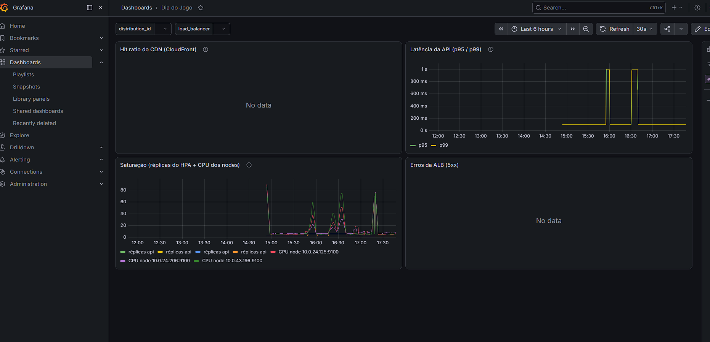

# Phase 6 — Game day

> Phase retrospective, written at its end. Does not repeat the content of ADRs and runbooks — links to them. Serves as input for the project's final documentation (see `CLAUDE.md`, "Repository structure" section). Also the final report required by the phase's completion criterion — see "Final state of the phase" section.

## Phase goal

Last phase of the roadmap. k6 wave scenarios; HPA (and optionally KEDA); simple chaos experiments; incident-response runbook. Completion criterion (`CLAUDE.md`): *"A final report in `docs/` with charts, what broke first, and lessons learned"*.

## What was delivered

| Deliverable | Where it lives | PR(s) |
| --- | --- | --- |
| Fix for the Job TTL bug exposed by the 1st load test | `app/api/jobs.py`, image `v0.1.4` | #20 |
| `load/k6/baseline.js` + runbook | `load/k6/`, `docs/runbooks/load/run-k6-baseline.md` | #21 |
| `load/k6/breakpoint.js` + `run-breakpoint-from-ec2.sh` + runbook | `load/`, `docs/runbooks/load/run-k6-breakpoint.md` | #21, #26 |
| HPA + metrics-server + PDB (ADR 012) | `gitops/app/{hpa,pdb}.yaml`, `gitops/platform/metrics-server/` | #22 |
| `load/k6/waves.js` + `run-waves-from-ec2.sh` + runbook | `load/`, `docs/runbooks/load/run-k6-waves.md` | #26 |
| Fix for `readinessProbe`/`livenessProbe` (timeout too short under saturation) | `gitops/app/deployment.yaml` | #27 |
| 3 chaos experiments + `docs/runbooks/incident-response.md` | `chaos/`, `docs/runbooks/chaos-*.md` | #25, #28, #29, #30 |
| Latency SLO revised with real data | `gitops/platform/kube-prometheus-stack/slo-rules.yaml` | #31 |
| Backfill of the Phase 4 and 5 retrospectives | `docs/phases/004-*.md`, `005-*.md` | #24 |
| "Game day" dashboard rebuilt as code | `gitops/platform/kube-prometheus-stack/dashboard-game-day.yaml` | *(this PR)* |

## Architecture decisions (ADRs)

- **[ADR 012](../adr/012-hpa-cpu-autoscaling.md)** — the phase's central decision: CPU-based HPA (not Cluster Autoscaler/Karpenter), `minReplicas: 2`/`maxReplicas: 6`/`averageUtilization: 70%`, `metrics-server` via GitOps, `PodDisruptionBudget`. Guided by real baseline/breakpoint data, not an estimate.

## Real bugs found and fixed

None of these showed up outside a real load test or chaos experiment — reinforcing, once again, "exists vs. works" (`docs/engineering-standards.md` §11):

1. **Job TTL masking valid videos as 404** (`app/api/jobs.py`) — the first breakpoint test exposed that `GET /api/videos/{id}` relied solely on the Kubernetes `Job` (garbage-collected 1h after finishing) as the source of truth. Fixed with a fallback to `s3_client.hls_playlist_exists()`.
2. **Client-side network noise masking the real capacity ceiling** — the first breakpoints, run locally (WSL2/home network), aborted with latencies the server never saw (confirmed via Prometheus/CloudWatch). Fixed by running k6 from an ephemeral EC2 instance inside the VPC itself (`run-breakpoint-from-ec2.sh`/`run-waves-from-ec2.sh`).
3. **Single-replica CPU bottleneck** — with that noise eliminated, the real breakpoint showed the `api` pod saturating its `500m` CPU (single replica, no HPA) from ~125-130 combined req/s onward, while the nodes had plenty of headroom left. Motivated the HPA (ADR 012).
4. **New real ceiling post-HPA: `maxReplicas: 6`, not single-replica CPU** — scaling the breakpoint up to `PEAK_RATE=800`, the HPA hit its own `maxReplicas: 6` (3 aggregated cores) and held there under growing demand, causing queueing (latency rising to `p95=1.04s`, `max=12.94s`) with no real errors (`0.00%`) — controlled-saturation behavior, not a crash.
5. **Probes killing overloaded, not stuck, pods** — the waves scenario (`waves.js`) exposed that `readinessProbe`/`livenessProbe` (`gitops/app/deployment.yaml`) had no explicit `timeoutSeconds` (Kubernetes default: 1s) — too short against the real `p95=2.42s` at peak. The `kubelet` was killing pods that were overloaded, cutting capacity right when the HPA needed it most. The phase's most valuable finding in terms of "what broke first": it wasn't aggregate capacity (the HPA absorbed the peak as expected), it was a miscalibrated probe amplifying the very saturation the HPA was trying to resolve.
6. **`disable-observability-stack.sh` — three bugs in sequence, only in the test script, not the architecture:** (a) it tried to discover a `video_id` via `GET /api/videos`, a route that never existed (only `POST /api/videos` and `GET /api/videos/{id}`) — the script aborted silently under `set -euo pipefail`; (b) workload discovery by `app.kubernetes.io/instance` (Helm's label) never covered the real Prometheus/Alertmanager StatefulSet, dynamically created by the Prometheus Operator with its own labels — the first "valid" result (`FAIL`, 18.75% error rate) meant nothing, because Prometheus had never actually gone down; (c) the fix (discovery by exclusion) accidentally swept up `metrics-server` (a separate Application, out of the experiment's scope), whose never-paused `selfHeal` reverted the `scale --replicas=0` on its own — harmless, but fixed.
7. **The "game day" dashboard never existed as code** — only discovered while looking for the visual evidence for this report. `values.yaml` already configures the Grafana sidecar to load dashboards from ConfigMaps (`grafana_dashboard`), but the dashboard itself, visually confirmed in Phase 5, was built directly in the UI and never committed — with `grafana.persistence.enabled: false` (intentional), it disappears every time `terraform/envs/lab` is recreated. Fixed with `gitops/platform/kube-prometheus-stack/dashboard-game-day.yaml`, the same 4 panels as a versioned ConfigMap.

## How we validated it

Full results in each runbook — just the summary here:

- **[`run-k6-baseline.md`](../runbooks/load/run-k6-baseline.md):** light load, 0% errors, p95 of 50-190ms depending on the endpoint.
- **[`run-k6-breakpoint.md`](../runbooks/load/run-k6-breakpoint.md):** pre-HPA, saturates at ~125-130 req/s (single-replica CPU); post-HPA, `PEAK_RATE=400` clean (p95=48ms); `PEAK_RATE=800` finds the new real ceiling (`maxReplicas: 6`, p95=1.04s, 0% errors).
- **[`run-k6-waves.md`](../runbooks/load/run-k6-waves.md):** confirms the HPA scaling down after the peak (6→3→2, "All metrics below target") — no other test in the phase exercised this. Exposes bug 5 above.
- **[`chaos-kill-api-pod.md`](../runbooks/chaos/chaos-kill-api-pod.md):** PASS, 0% error, clean recovery via `minReplicas`+PDB.
- **[`chaos-drain-spot-node.md`](../runbooks/chaos/chaos-drain-spot-node.md):** PASS, API rescheduling (and several platform singletons sharing the node) within the timeout.
- **[`chaos-disable-observability-stack.md`](../runbooks/chaos/chaos-disable-observability-stack.md):** PASS confirmed on the 3rd iteration — with Prometheus/Alertmanager genuinely down, the API and HLS kept serving 100% of traffic (0% error).

## Charts/Visual evidence

"Game day" dashboard rebuilt as code in `gitops/platform/kube-prometheus-stack/dashboard-game-day.yaml` (bug 7 above — the Phase 5 original had never been committed). Real screenshot, exported by the operator after ArgoCD synced (`Last 6 hours`, covering this session's tests):

- **API latency (p95/p99):** the two visible spikes (~16:00 and ~16:30, hitting close to 1s) coincide with the heaviest breakpoint/waves tests — the real data behind the SLO revision (`APILatencyCritical` at 800ms).
- **Saturation (HPA replicas + node CPU):** several spikes throughout the afternoon, one per load test run in this session — visually confirms the HPA scaling pattern discussed in the runbooks.
- **CDN hit ratio:** `No data` — expected and already documented in PR #33: requires "Additional metrics" enabled on the CloudFront distribution (extra cost, not turned on in `cloudfront.tf`). The real hit ratio was already confirmed by another path (the `X-Cache` header) in `scripts/validate-cloudfront-dns-tls.sh`.
- **ALB errors (5xx):** `No data` — plausibly correct, not a broken panel: CloudWatch doesn't publish data points for count metrics that never had an event (>0) in the window, and every test in this phase (breakpoint, waves, the 3 chaos experiments) reported an error rate of ~0% client-side. Consistent with "no real 5xx happened," not with "the panel doesn't work."

## Lessons learned

- **Liveness probes with default timeouts are a real risk under real saturation, not just a theoretical one.** A slow (but alive) pod being killed by its own probe is a self-amplifying pattern — it cuts capacity exactly when it's needed most. Worth reviewing in any Deployment that has gone through a real load test, not just copying the `readinessProbe`/`livenessProbe` example from the documentation without adjusting timeouts to real behavior under load.
- **The load generator needs to run from inside the same network environment as the target.** Client-side network noise (WSL2, home ISP) can completely mask the real saturation signal — it only became clear by cross-referencing server-side metrics (Prometheus, CloudWatch), never trusting only what k6 reported.
- **Test scripts (including chaos ones) deserve the same "exists vs. works" skepticism as the infrastructure they test.** A `FAIL` from a script with a resource-discovery bug (`disable-observability-stack.sh`) almost became a wrong conclusion about the architecture — only manually checking the list of actually-scaled workloads prevented that.
- **An HPA's `maxReplicas` is a configuration decision, not a physical limit.** The nodes still had plenty of headroom even at the current ceiling — raising `maxReplicas` is the natural next tweak if the goal is to support more than ~800 req/s at peak, not a change in autoscaling strategy.
- **Pausing ArgoCD's `selfHeal` via `kubectl patch` is safe when formalized as a versioned script and always reverted** — but it needs to be scoped precisely (the `metrics-server` incident showed what happens when a resource outside the intended scope gets swept up by mistake: ArgoCD silently fights the change without breaking anything, but generates confusing noise in the result).
- **"Everything is code" needs active verification, not just good intentions.** The mechanism for dashboards-as-code already existed since Phase 5 (Grafana sidecar configured, `persistence.enabled: false` on purpose) — but nothing verified that the "game day" dashboard had actually been committed, only that it existed and worked in that session. The gap stayed invisible for two full phases until someone needed the dashboard in a new session.

## Final state of the phase

- Completion criterion met: final report ✅ (this document, with real charts ✅), what broke first ✅ ("Real bugs" section above — the central finding was the miscalibrated probe, not a lack of capacity), lessons learned ✅.
- PRs for this phase: #20, #21, #22, #24, #25, #26, #27, #28, #29, #30, #31, #33 — all merged into `main`.
- **Phase 6 (Game day) formally closed.**

## Next phase

None — Phase 6 is the last one in the planned roadmap (`CLAUDE.md`, phases table). Future work is at the operator's discretion: candidates already on record include finding the exact capacity ceiling (scaling `PEAK_RATE` beyond 800), KEDA as an alternative to CPU-based HPA, and the decision to make the repository public for a portfolio (see ADR 007).
